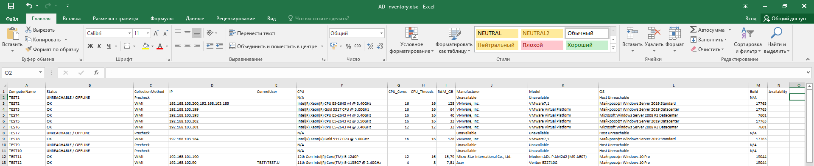
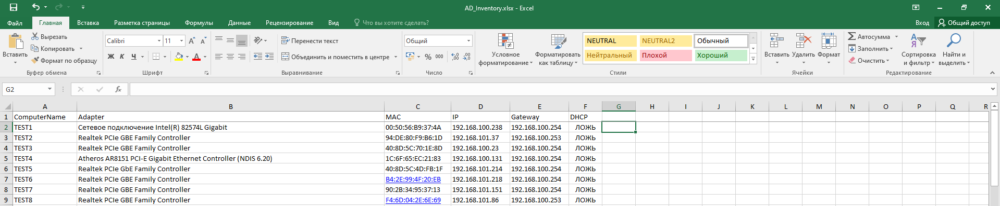
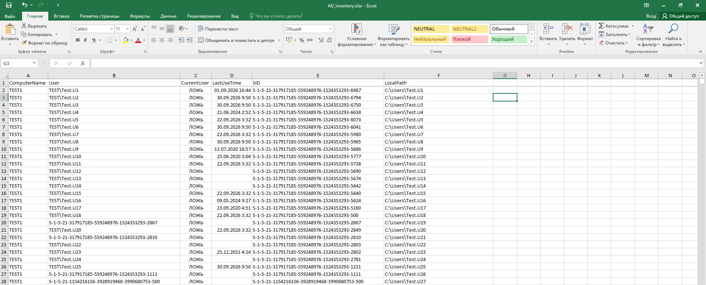
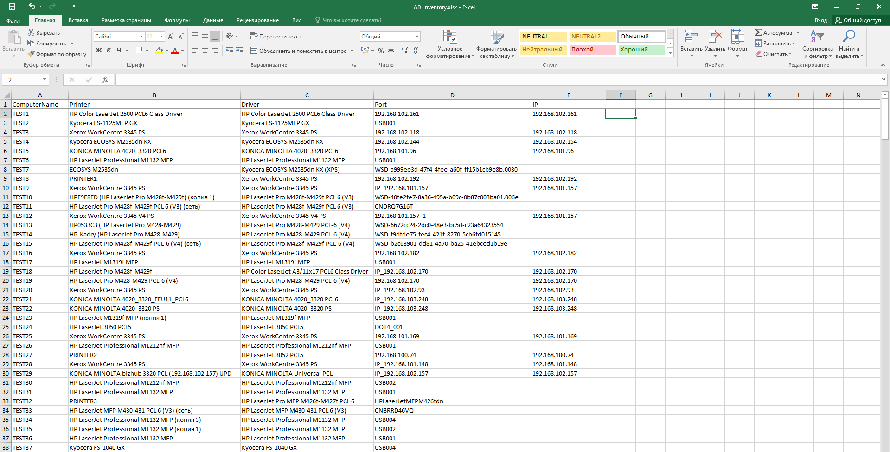
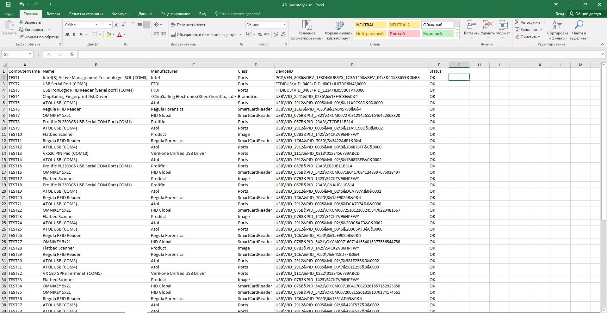
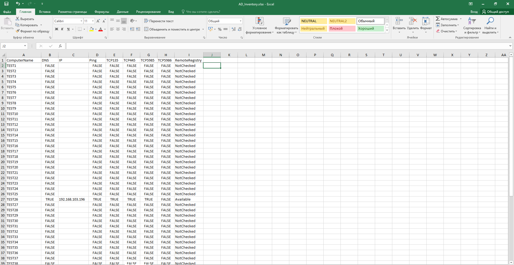
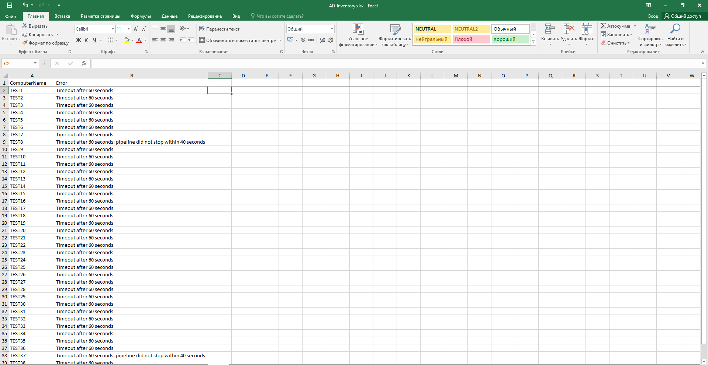

# AD_Inventory
PowerShell script to collect basic PC data within a domain and output the results as an Excel table.

This script was tested on Windows 10 PowerShell 5.1 but should work on both newer and older versions.

The script collects PC information, specifically: CPU details (including core and thread counts); RAM specifications; details on the currently logged-in user and all users who have previously signed in on the machine; OS and build version; computer name; IP address and all network interfaces; manufacturer and model information; and details on peripherals (excluding mice and keyboards).

All results are exported to an Excel spreadsheet, with functionality included to append data to an existing file.

Connection diagnostics are performed when errors occur, and the diagnostic results and error details are recorded on a separate sheet within the Excel spreadsheet.

# Screenshots:

## Sheet Computers

  

## Sheet Network

  

## Sheet Users

  

## Sheet Printers

  

## Sheet Devices

  

## Sheet Diagnostics

  

## Sheet Errors

  

